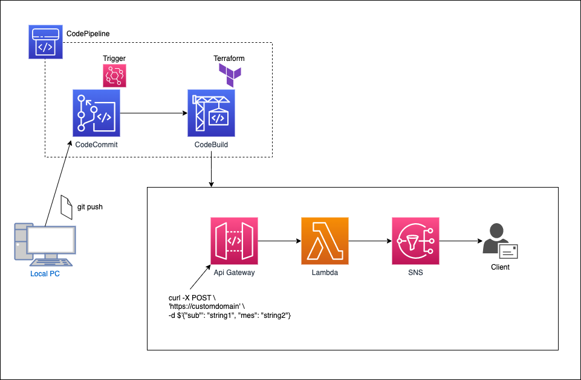
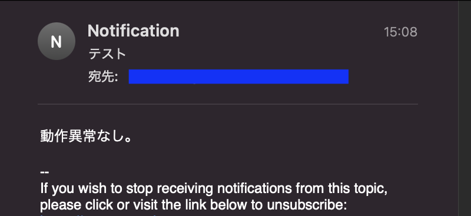

# codefamily-terraform
## Refferemce article
Zennに投稿した、「CodePipelineとTerraformで、API Gatewayをビルド【CodeFamily Practices 7/7】」に掲載したコードを収録したリポジトリ。

<a href="https://zenn.dev/lifewithpiano/articles/codefamily_serverless">

## Summary
API GatewayとLambdaの挙動を確認するための、シンプルな構成。

* ソースステージをCodeCommit、ビルドステージをCodeBuildに設定したCodePipelineを構築。
* ビルドはTerraformを使用。
* API Gatewayへメールのタイトルと本文を指定してアクセスをすると、SNSトピックのサブスクリプションへメールを送信
* 送信に成功すると、サブジェクトとメッセージの値をレスポンス。



* __コマンド__

```
curl -X POST \
'https://Your-domain-name' \
-d $'{"sub": "テスト", "mes": "動作異常なし。"}'
```
* __メール__



